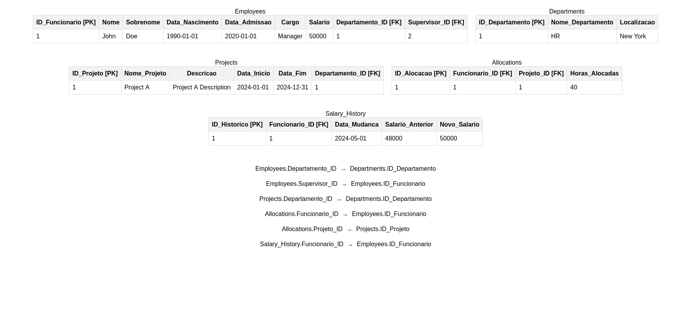

# Vincenzo Amendola 
# Lucas Matos

### Nome do(a) Aluno(a)
Profº.: André Cassulino

## Escopo 1

Estamos desenvolvendo um sistema de registro de ponto para facilitar o acompanhamento das jornadas de trabalho dos nossos funcionários. Esse sistema permitirá que cada colaborador registre suas entradas e saídas em horários pré-estabelecidos, garantindo conformidade com as normas trabalhistas e proporcionando um controle preciso das horas trabalhadas.

O funcionamento do sistema é simples e eficiente. Ao iniciar o expediente, o funcionário registra sua entrada no sistema, utilizando um dispositivo eletrônico, como um computador ou smartphone, ou por meio de um terminal de ponto físico. Durante os horários de intervalo, como o almoço, o colaborador registra a saída e, ao retornar, registra novamente sua entrada. Ao final do expediente, o funcionário registra sua saída, encerrando a contagem de horas daquele dia.

A interface do sistema será amigável e intuitiva, permitindo fácil acesso e operação. Cada colaborador terá um login individual para garantir a segurança e a precisão dos registros. Haverá notificações e lembretes para ajudar os funcionários a não esquecerem de registrar suas entradas e saídas.

O sistema será configurado de acordo com as políticas da empresa e a legislação vigente, incluindo regras de jornada, horas extras e períodos de descanso. Todos os registros serão armazenados em um banco de dados seguro, garantindo a integridade e a disponibilidade dos dados para consultas futuras. Ao final de cada mês, o sistema gerará automaticamente um extrato detalhado das horas trabalhadas, incluindo entradas, saídas, intervalos e horas extras. Esse relatório servirá como comprovação das jornadas de trabalho, tanto para os funcionários quanto para o departamento de recursos humanos.

### Ferramentas Escolhidas (Algumas em fase de teste)
- **Python**: Linguagem de programação.
- **Serviço de autenticação**: Python-jose, UUID64, JWT.
- **FrameWork Python**: Django ou FastApi.
- **Locust e K6**: Ferramentas de teste de carga e desempenho.
- **ORM e Configurações de Banco de Dados**: Pymongo, Pydantic, PostgreSQL, MongoDB.
- **React e Vite**: Utilizando TypeScript ou HTML/CSS/SASS.
- **Ambiente de Desenvolvimento ou Deploy (Containerização)**: Docker ou Podman (pods).
- **Serviço de Observabilidade/Monitoramento**: Grafana, Loki, Tempo, Prometheus.

### Função de Cada Integrante
- **Lucas Matos (DevOps, Dev Python)**: Responsável pela containerização, gestão de Gitflow, e implementação de padrões de projetos.
- **Vincenzo Amendola (Dev Python, Data Science, PO)**: Desenvolvimento em Python, testes, e observabilidade.

### Gestão do Projeto
- **GitHub**: Git para versionamento de commits, usando o padrão gitflow com padrões de branches, develop, feature, master, main.

### Estrutura de banco de dados (versão beta)

